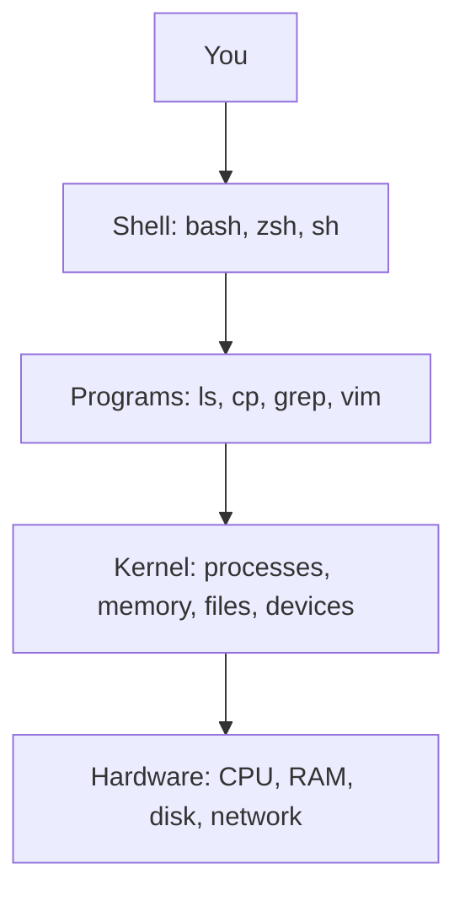
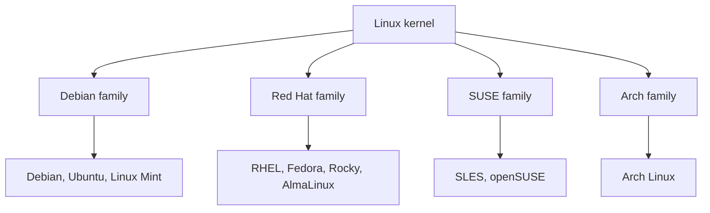
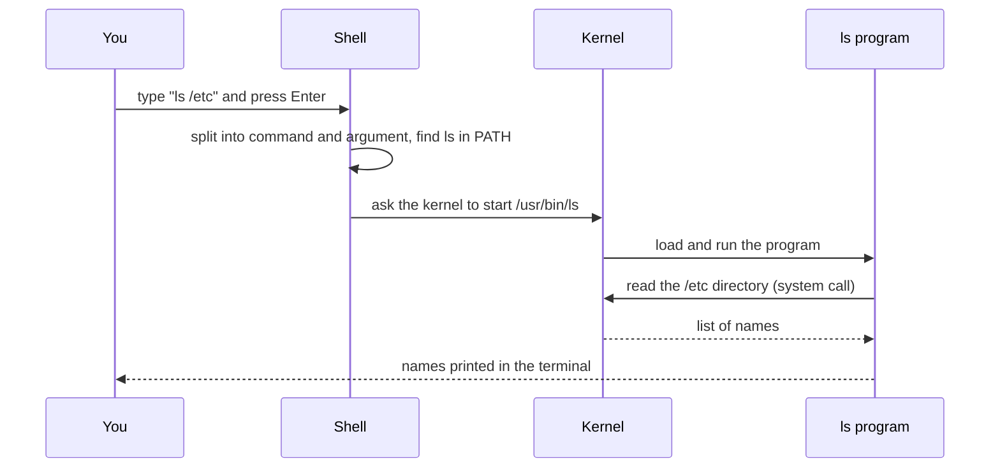

# **Introduction**

## **What is Unix?**

Unix is an operating system created in 1969 at Bell Labs by Ken Thompson and Dennis Ritchie. Many later systems were built on its ideas, including Linux, macOS, and BSD.

Main features of Unix:

- **Multi-user:** many users can use the same system at the same time.
- **Multi-tasking:** many programs can run at the same time.
- **Command line and graphical interface:** you can work with commands in a terminal (CLI) or with windows and a mouse (GUI).
- **Portable:** it is written in the C language, so it can run on different types of hardware.
- **Secure:** each file has an owner and permissions, and users must log in.

---

## **What is Linux?**

Linux is an operating system **kernel** created by Linus Torvalds in 1991. It was written to work like Unix, but it is a new project, not a copy of Unix code.

- Linux is **FOSS** (Free and Open Source Software). "Free" means you are allowed to use, change, and share it. It does not only mean no cost.
- Anyone can read the source code, fix bugs, and add features.
- The Linux kernel is released under the **GNU General Public License (GPL)**.

### **Unix vs Linux**

| Point | Unix | Linux |
|---|---|---|
| Started | 1969 | 1991 |
| Created by | Bell Labs (AT&T) | Linus Torvalds and the community |
| License | Mostly proprietary | Open source (GPL) |
| Cost | Usually paid | Mostly free |
| Examples | AIX, HP-UX, Solaris | Ubuntu, Debian, Fedora, RHEL |
| Runs on | Mostly specific hardware | Almost any hardware |

---

## **Kernel and Distribution**

The word "Linux" can mean two things. It helps to know the difference.

- **Kernel:** the core part of the system. It controls the CPU, memory, disks, and devices.
- **Distribution (distro):** the kernel plus extra software, such as a shell, tools, a package manager, an installer, and sometimes a desktop.

### **Layers of a Linux system**

You do not talk to the hardware directly. Each layer talks to the one below it.



- **Shell:** reads the commands you type and starts programs.
- **Programs:** tools that do one job each.
- **Kernel:** the only layer that talks to the hardware.

### **Distribution families**

Different companies and communities took the same Linux kernel and built their own distributions.



| Family | Distributions | Package manager |
|---|---|---|
| Debian | Debian, Ubuntu, Linux Mint | `apt` |
| Red Hat | RHEL, Fedora, CentOS Stream, Rocky Linux, AlmaLinux | `dnf` (older: `yum`) |
| SUSE | SLES, openSUSE | `zypper` |
| Arch | Arch Linux | `pacman` |

Notes:
- All distributions share the same basic commands and file layout. If you learn one, you can work on any other with little effort.
- The difference is mostly in the package manager, default tools, and release style.
- A full list of distributions is available at [distrowatch.com](https://www.distrowatch.com).

---

## **How a Command Runs**

When you type a command, several parts work together. This is the flow for `ls /etc`:



Step by step:

1. You type a command. The shell splits it into the **command** (`ls`) and its **argument** (`/etc`).
2. The shell looks for a program named `ls` in the folders listed in the `PATH` variable.
3. The shell asks the kernel to start that program.
4. The program asks the kernel for the data it needs. These requests are called **system calls**.
5. The program prints the result to your terminal.

`PATH` and system calls are covered in later phases. For now, remember that the shell starts programs and the kernel does the real work.

---

## **Linux vs Windows**

| Point | Linux | Windows |
|---|---|---|
| Cost | Mostly free | Paid license |
| Source code | Open | Closed |
| Main interface for admins | Command line | Graphical |
| Users | Multi-user by design | Mainly single-user desktop |
| Case sensitivity | `File.txt` and `file.txt` are different | Treated as the same |
| Path separator | `/` | `\` |
| Updates | You choose when to update; reboot is rarely needed | Often needs a reboot |

Linux is considered more secure for these reasons:

- Normal users cannot change system files. Only the root user can.
- Software is installed from trusted repositories.
- Many people review the open source code.
- Most viruses target Windows, not Linux.

No system is fully safe. A badly configured Linux server can still be attacked.

---

## **Where Linux is Used**

- Most web servers and cloud servers (AWS, Azure, Google Cloud)
- All of the world's top 500 supercomputers
- Android phones (Android is built on the Linux kernel)
- Routers, smart TVs, and embedded devices
- Containers (Docker, Kubernetes)
- CI/CD servers and DevOps tools

Because of this, Linux is a basic skill for DevOps and cloud engineers.

---

## **Why Learn Linux?**

- Most servers you will work on run Linux.
- DevOps tools such as Docker, Git, Ansible, and Jenkins are built for Linux.
- Commands can be put into scripts, so repeated work can be automated.
- It is free, so you can practice at home.

---

## **Ways to Use Linux for Practice**

| Option | Notes |
|---|---|
| WSL2 with Ubuntu | Easiest on Windows. Runs inside Windows. |
| Virtual machine | VirtualBox or VMware. Safe, and you can take snapshots. |
| Docker container | Light and quick to start. |
| Cloud server | A small VM on a cloud provider. |
| Dual boot | Install next to Windows. Needs care, since it changes your disk. |

Do not practice risky commands on your main machine.

---

## **Try It: Know Your System**

Open a terminal and run these commands. Each one tells you something about the system you are on.

```bash
cat /etc/os-release      # which distribution and version
uname -r                 # kernel version
echo $SHELL              # your default shell
whoami                   # current user
```

Example output on Ubuntu:

```text
PRETTY_NAME="Ubuntu 24.04 LTS"
NAME="Ubuntu"
VERSION_ID="24.04"
...
5.15.153.1-microsoft-standard-WSL2
/bin/bash
akshay
```

Your output will differ. On WSL2 the kernel version contains `microsoft`, as shown above.

`/etc/os-release` exists on almost every modern distribution. Use it to identify any Linux system you log into.

---

## **Commands for Directory and File Creation**

These examples use **brace expansion**. The shell expands `{1..50}` into the numbers 1 to 50 before the command runs.

**Create many directories at once:**

```bash
mkdir dir{1..50}
```

This creates `dir1`, `dir2`, ... `dir50`.

**Create many files in those directories:**

```bash
touch dir{1..50}/file{1..5}
```

This creates `file1` to `file5` inside each directory, which is 250 files in total. The directories must already exist, so run the `mkdir` command first.

**Check the result:**

```bash
ls dir1
```

Expected output:

```text
file1  file2  file3  file4  file5
```

**Clean up when you are done:**

```bash
rm -r dir{1..50}
```

Brace expansion also works with letters and lists:

```bash
mkdir {jan,feb,mar}
touch file{a..e}.txt
echo {a..e}
```

---

## **Common Mistakes**

| Mistake | What happens | Fix |
|---|---|---|
| Typing `File.txt` when the file is `file.txt` | `No such file or directory` | Linux is case sensitive. Match the name exactly. |
| Running `touch dir{1..50}/file{1..5}` before `mkdir` | `No such file or directory` | Create the directories first. |
| Running `mkdir a/b/c` when `a` does not exist | `No such file or directory` | Use `mkdir -p a/b/c`. |
| Putting spaces inside braces, like `{1.. 5}` | No expansion happens | Write `{1..5}` with no spaces. |
| Running brace expansion with `sh` | May not expand on some systems | Use `bash`. On Ubuntu, `sh` is `dash`. |
| Running `rm -r` with the wrong path | Files are deleted with no undo | Check with `ls` first, and read the command before pressing Enter. |

---

## **Summary**

- Unix started in 1969. Linux started in 1991 and works like Unix.
- Linux is free and open source. Unix is mostly proprietary.
- Linux is a kernel. A distribution is the kernel plus other software.
- The shell starts programs. The kernel talks to the hardware.
- Both Unix and Linux are multi-user and multi-tasking.
- Linux runs most servers, cloud systems, and containers.
- All distributions share the same basic commands, so learning one is enough to start.
- `cat /etc/os-release` tells you which distribution you are on.

---

## **Practice**

1. What is the difference between Unix and Linux?
2. What is the difference between a kernel and a distribution?
3. Name three distributions and their package managers.
4. What does FOSS mean?
5. In the "layers" diagram, which layer talks to the hardware?
6. Run `cat /etc/os-release`. Which distribution and version are you using?
7. Create directories `test1` to `test10`, then create `a.txt` and `b.txt` in each. Check one directory with `ls`, then remove them all.
8. What does `echo {a..e}` print? Run it and check.
9. Run `ls /Etc` and `ls /etc`. Why do the results differ?