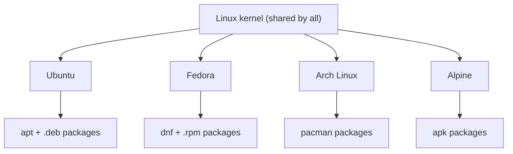
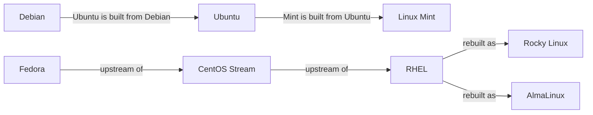

# **Linux Distributions**

## **What is a Distribution?**

A **distribution** (distro) is the Linux kernel packaged with the software needed to use it:

- Shell and core tools (`bash`, `ls`, `cp`, `grep`)
- A package manager to install and update software
- An installer and default configuration
- Optionally a desktop environment

The kernel is the same everywhere. Distributions differ in what they bundle, how they update, and how long they are supported.



---

## **Distribution Families**

Most distributions are built on top of another one. Distributions in the same family share the package format, package manager, and many file locations.

| Family | Base distribution | Examples | Package format | Package manager |
|---|---|---|---|---|
| Debian | Debian | Debian, Ubuntu, Linux Mint, Kali Linux | `.deb` | `apt`, `dpkg` |
| Red Hat | Fedora, RHEL | Fedora, RHEL, CentOS Stream, Rocky Linux, AlmaLinux, Amazon Linux | `.rpm` | `dnf`, `rpm` |
| SUSE | SUSE | SLES, openSUSE | `.rpm` | `zypper`, `rpm` |
| Arch | Arch Linux | Arch Linux, Manjaro | `.pkg.tar.zst` | `pacman` |
| Alpine | Alpine Linux | Alpine Linux | `.apk` | `apk` |

Notes:

- `yum` is the older Red Hat package manager. On current systems, `yum` is usually a link to `dnf`.
- Amazon Linux 2 uses `yum`. Amazon Linux 2023 uses `dnf`.
- Alpine uses `musl` instead of `glibc` and is very small, so it is common in container images.

### **How the Debian and Red Hat families relate**



- **Upstream** means the source a distribution gets its changes from. Fedora gets new features first. They then move into CentOS Stream and RHEL.
- **Rocky Linux** and **AlmaLinux** rebuild RHEL, so they are binary-compatible with it and free to use.
- **CentOS Linux** was the older free RHEL rebuild. CentOS Linux 8 ended in December 2021 and CentOS Linux 7 ended in June 2024. Use Rocky Linux or AlmaLinux as the replacement.

---

## **Release Models**

| Model | How it works | Examples | Good for |
|---|---|---|---|
| Fixed release | A new version comes out on a schedule. Each version gets updates for a set period. | Debian stable, Fedora | Predictable systems |
| LTS (long-term support) | A fixed release with a long support period, often 5 to 10 years. | Ubuntu LTS, RHEL, SLES | Servers, production |
| Rolling release | No versions. You keep updating and always get the newest software. | Arch Linux, openSUSE Tumbleweed | Desktops, people who want the newest software |

Terms you will see:

- **LTS:** long-term support. Security fixes continue for years.
- **EOL (end of life):** the date support ends. After this date there are no security updates.
- **Stable:** tested and changes slowly, so it is less likely to break.

Ubuntu releases a new version every six months, in April and October. Every April of an even-numbered year is an LTS release, for example 22.04 and 24.04. Use LTS versions for servers and learning.

Check the vendor's website for current dates, because versions and support periods change.

---

## **Common Distributions**

| Distribution | Family | Typical use | Notes |
|---|---|---|---|
| Ubuntu (LTS) | Debian | Cloud servers, desktops, learning, WSL2 | Large community, many tutorials |
| Debian | Debian | Stable servers | Very stable, slower to get new software |
| Linux Mint | Debian (via Ubuntu) | Desktop | Beginner-friendly desktop |
| Kali Linux | Debian | Security testing | Not for everyday use |
| RHEL | Red Hat | Enterprise servers | Paid support subscription |
| Rocky Linux, AlmaLinux | Red Hat | Servers | Free, RHEL-compatible |
| Fedora | Red Hat | Desktop, developers | New features, short support per release |
| Amazon Linux | Red Hat | AWS virtual machines | Built for AWS |
| SLES, openSUSE | SUSE | Enterprise servers, SAP workloads | Strong in Europe |
| Arch Linux | Arch | Advanced desktop users | Rolling release, manual setup |
| Alpine Linux | Alpine | Container images | Very small |

---

## **How to Choose**

| Goal | Suggested choice | Reason |
|---|---|---|
| Learning Linux (this repo) | Ubuntu LTS | Works on WSL2, uses `apt`, most examples online use it |
| DevOps and cloud work | Ubuntu LTS and one Red Hat family distro | Most servers are one of these two |
| Company with a RHEL environment | Rocky Linux or AlmaLinux | Same behavior as RHEL, free |
| Container images | Alpine or Debian slim | Small images |
| AWS virtual machines | Amazon Linux or Ubuntu | Well supported on AWS |
| Beginner desktop | Linux Mint or Ubuntu | Easy to install and use |

Learn one distribution well first. Then learn the differences between the Debian family and the Red Hat family, because these two cover most servers.

---

## **Identify Your Distribution**

Run these on any Linux system.

```bash
cat /etc/os-release
```

Example output on Ubuntu:

```text
PRETTY_NAME="Ubuntu 24.04 LTS"
NAME="Ubuntu"
VERSION_ID="24.04"
ID=ubuntu
ID_LIKE=debian
```

Important fields:

| Field | Meaning |
|---|---|
| `NAME`, `PRETTY_NAME` | Distribution name |
| `VERSION_ID` | Version number |
| `ID` | Short name, useful in scripts |
| `ID_LIKE` | Family the distribution is based on |

`ID_LIKE` shows the family. On Rocky Linux it lists `rhel`, `centos`, and `fedora`.

Other commands:

```bash
hostnamectl              # OS name, kernel, architecture
lsb_release -a           # distribution info (may not be installed)
uname -r                 # kernel version
cat /etc/debian_version  # exists on the Debian family only
cat /etc/redhat-release  # exists on the Red Hat family only
```

Notes:

- `/etc/os-release` is the most reliable, since nearly every modern distribution has it.
- `lsb_release` is not installed by default on many Red Hat systems and minimal images.
- `uname -r` shows the **kernel** version, not the distribution version.

---

## **Try It: Compare Distributions with Docker**

If Docker is installed, you can open different distributions in seconds. Each command starts a container and drops you into its shell. Type `exit` to leave.

```bash
docker run -it --rm ubuntu bash
docker run -it --rm rockylinux:9 bash
docker run -it --rm alpine sh
```

In each one, run:

```bash
cat /etc/os-release
uname -r
```

You will see:

- `/etc/os-release` is different in each, so the distribution is different.
- `uname -r` is the same in all of them, because containers share the host's kernel.

This shows the difference between a kernel and a distribution.

If you do not have Docker, use WSL2 and install a second distribution:

```powershell
wsl --list --online
wsl --install -d Debian
```

---

## **Same Task, Different Commands**

Installing and managing software is the biggest day-to-day difference between families. These examples use `nginx` as the package.

| Task | Debian family (Ubuntu) | Red Hat family (Rocky, RHEL) | SUSE | Arch |
|---|---|---|---|---|
| Refresh package list | `sudo apt update` | automatic with `dnf` | `sudo zypper refresh` | `sudo pacman -Sy` |
| Install | `sudo apt install nginx` | `sudo dnf install nginx` | `sudo zypper install nginx` | `sudo pacman -S nginx` |
| Remove | `sudo apt remove nginx` | `sudo dnf remove nginx` | `sudo zypper remove nginx` | `sudo pacman -R nginx` |
| Search | `apt search nginx` | `dnf search nginx` | `zypper search nginx` | `pacman -Ss nginx` |
| Upgrade all | `sudo apt upgrade` | `sudo dnf upgrade` | `sudo zypper update` | `sudo pacman -Syu` |
| List installed | `apt list --installed` | `dnf list installed` | `zypper search -i` | `pacman -Q` |
| Low-level tool | `dpkg` | `rpm` | `rpm` | |

On Alpine, the install command is `apk add nginx`.

Details of package management are in Phase 19. For now, only remember that the command depends on the family.

Other differences you will notice:

| Item | Debian family | Red Hat family |
|---|---|---|
| Default firewall tool | `ufw` (Ubuntu) | `firewalld` |
| Default security module | AppArmor | SELinux |
| Network config | Netplan (Ubuntu) | NetworkManager |
| Web server package name | `apache2` | `httpd` |

Things that stay the same everywhere: the core commands (`ls`, `cp`, `grep`), the file layout, permissions, `systemd`, and SSH.

---

## **Common Mistakes**

| Mistake | What happens | Fix |
|---|---|---|
| Running `apt install` on Rocky Linux | `command not found` | Use `dnf install`. |
| Running `yum` or `dnf` on Ubuntu | `command not found` | Use `apt`. |
| Using `lsb_release -a` on a minimal system | `command not found` | Use `cat /etc/os-release`. |
| Reading `uname -r` as the distribution version | Shows the kernel version | Use `/etc/os-release` for the distribution. |
| Using a non-LTS Ubuntu release on a server | Support ends after about nine months | Use LTS releases. |
| Using an EOL distribution | No security updates | Upgrade before the EOL date. |
| Following a CentOS Linux tutorial on a new system | CentOS Linux is discontinued | Use Rocky Linux or AlmaLinux. |
| Searching for the wrong package name | `Unable to locate package` | Names differ by family. Search with `apt search` or `dnf search`. |

---

## **Summary**

- A distribution is the Linux kernel plus tools, a package manager, and defaults.
- The main families are Debian, Red Hat, SUSE, Arch, and Alpine.
- Ubuntu is built from Debian. Rocky Linux and AlmaLinux are rebuilds of RHEL.
- Release models are fixed, LTS, and rolling. Use LTS for servers.
- Use `cat /etc/os-release` to identify any distribution.
- The package manager is the main difference between families. Debian family uses `apt`, Red Hat family uses `dnf`.
- Core commands and the file layout are the same everywhere.
- This repo uses Ubuntu. Learn the Red Hat family differences after you are comfortable.

---

## **Practice**

1. What is the difference between a kernel and a distribution?
2. Name the package manager and package format for the Debian and Red Hat families.
3. What does LTS mean? Why is it preferred for servers?
4. Why is CentOS Linux no longer recommended? Name two replacements.
5. Run `cat /etc/os-release`. Write down `NAME`, `VERSION_ID`, `ID`, and `ID_LIKE`.
6. What does `ID_LIKE` tell you?
7. Which command shows the kernel version? Does it show the distribution version?
8. How do you install `nginx` on Ubuntu? How do you install it on Rocky Linux?
9. If you ran `docker run -it --rm alpine sh`, would `uname -r` match your host or differ? Why?
10. Which distribution would you choose for learning, and which for a container image? Explain why.