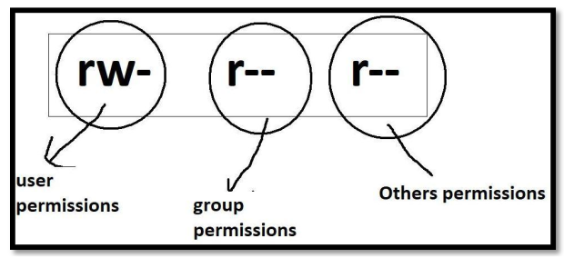

## File Permissions

File permissions describe the allowed operations that different types of users can perform on files or directories.

### User Categories

All users are divided into the following four types:

- **User/Owner**: Represented by `u`  
- **Group**: Represented by `g`  
- **Others**: Represented by `o`  
- **All**: Represented by `a`  

### Use Case: Understanding User Types

**Project: DURGASOFT COLLEGE AUTOMATION SYSTEM**  
This project is divided into multiple modules, with different developers working on each module:

1. **STUDENTS MODULE**: Developers A, B, C, D  
2. **EMPLOYEES MODULE**: Developers X, Y, Z  
3. **COURSES MODULE**: Developers M, N  
4. **INFRASTRUCTURE MODULE**: Developers G, H  

Example:  
**Developer 'A'** creates a file named `demo.txt`.  
- **User/Owner**: A (file creator)  
- **Group**: B, C, D (team members in the same module)  
- **Others**: X, Y, Z, M, N, G, H (developers from other modules)  

---

### Permission Types

For files and directories, the following types of permissions are available:

1. `r` → Read  
2. `w` → Write  
3. `x` → Execute  
4. `-` → No Permission  

---

### Table Of File Permissions

| Permission Type | For Files                                                                 | For Directories                                                              |
|------------------|--------------------------------------------------------------------------|-----------------------------------------------------------------------------|
| 1. Read (r)      | Read permission for the file means we can view content of the file.      | Read permission for the directory means we can list out contents of that directory (e.g., use `ls` command). |
| 2. Write (w)     | Write permission for the file means we can modify the content of the file. | Write permission for the directory means we can modify contents of that directory (e.g., create a new file or delete an existing file). |
| 3. Execute (x)   | Execute permission for the file means we can execute the file like a normal program. | Execute permission for the directory means we can enter into that directory (e.g., use `cd` command). |


### Operations Related to Permissions

We can perform three operations to manage permissions:

- `+` → Add a permission  
- `-` → Remove a permission  
- `=` → Assign specific permissions  

### chmod Command

The `chmod` command is used to change file or directory permissions.

**Syntax**:  
```bash
$ chmod <user_category><operation><permission> file_name/directory_name
```

**Example**:  
```bash
$ chmod u+x,g+w,o-r demo.txt
```
- Add execute permission for the user.  
- Add write permission for the group.  
- Remove read permission for others.  

**Note**: Only the owner or superuser (`root`) can change file permissions.

---

### Checking File Permissions

Use the `ls -l` command to check the permissions of an existing file.

**Example**:  
```bash
$ ls -l
-rw-r--r-- 1 durgasoft durgasoft 0 Nov 27 21:19 demo.txt
```



### Breakdown of Permissions
- **User Permissions**: `rw-` (read and write)  
- **Group Permissions**: `r--` (read only)  
- **Others Permissions**: `r--` (read only)  

**Order of Permissions**:  
- User → Group → Others  
- Read (`r`) → Write (`w`) → Execute (`x`)  

---

### Examples of chmod Command

### Example 1
```bash
$ chmod u+x demo.txt
```
- Adds execute permission to the user.

### Example 2
```bash
$ chmod u+w,g+rw,o+r demo.txt
```
- Adds write permission to the user.  
- Adds read and write permissions to the group.  
- Adds read permission to others.

### Example 3
```bash
$ chmod u+x,g-w,o+w demo.txt
```
- Adds execute permission to the user.  
- Removes write permission from the group.  
- Adds write permission to others.

### Example 4
```bash
$ chmod u=rw,g=rw,o=r demo.txt
```
- Sets user permissions to `rw-`.  
- Sets group permissions to `rw-`.  
- Sets others' permissions to `r--`.  
```